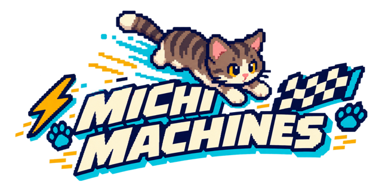

# Michi Machines

<p align="center">
  
</p>

Carreras arcade cenitales de gatos por territorios domésticos gigantes. Proyecto original creado con Godot 4 y orientado a web, macOS y iPhone/iPad.

## Estado actual

- Carrera de tres vueltas contra tres michis rivales.
- Selección de Ñau, Cajú, Romeo u Osama como corredor jugador.
- Cámara de seguimiento, superficies, colisiones, poderes automáticos y confeti de victoria.
- Podio/resultados, rival ganador y récord local por michi.
- Arte temporal de cocina y sprites iniciales de los cuatro michis.

## Ejecutar localmente

Se necesita Godot 4.7 o posterior.

```sh
godot --path .
```

Para una comprobación sin interfaz:

```sh
godot --headless --path . --quit-after 3
```

## Controles

| Acción | Teclado | Mando |
| --- | --- | --- |
| Acelerar | `W` / flecha arriba | A o RB |
| Frenar/reversa | `S` / flecha abajo | B o LB |
| Girar | `A` / `D` o flechas | Stick izquierdo |
| Pausa | `Esc` | — |
| Reintentar | `R` | — |
| Volver al último checkpoint | `Backspace` | — |

En dispositivos táctiles aparecen controles en pantalla.

## Arte

Los archivos fuente entregados se mantienen en `assets/`. Las versiones recortadas y optimizadas para el juego se guardan en `assets/sprites/` y `assets/ui/`.

Los prompts para crear arte adicional están en [prompts.md](prompts.md). El plan de desarrollo se mantiene en [PLAN.md](PLAN.md).
